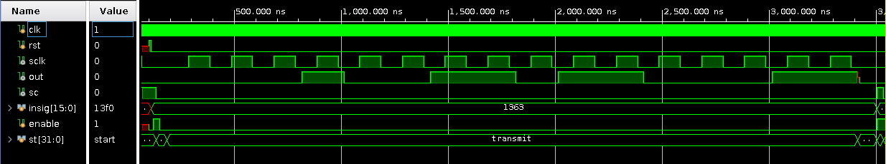

# Analog signal generator
A purpose of the generator is providing analog signals with SPI DAC. The control interface is Python script that sends instructions to FPGA with UART.
The generator provides curves: sin, abs(sin), triangle and saw. Samples for all the signals are stored in ROM memory and they are being send to DAC with SPI.

 
The Python interface allows user to choose curve shape, frequency and amplitude of signal.

    
    

